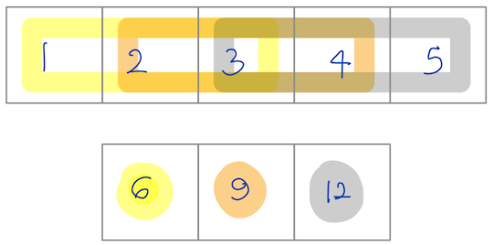
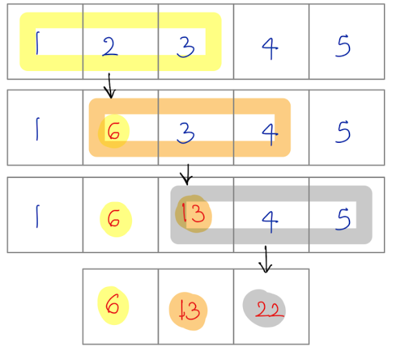
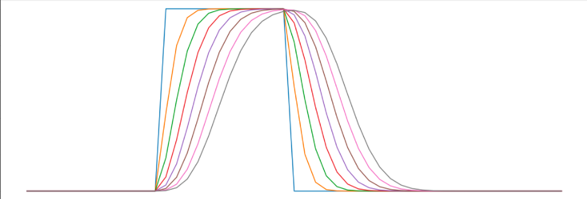

<div align = "center">

</div>

<h2 align="center">Differentiable Stencil computations in JAX </h2>

[**Installation**](#Installation)
|[**Description**](#Description)
|[**Quick Example**](#QuickExample)
|[**More Examples**](#MoreExamples)
|[**Benchmarking**](#Benchmarking)


[](https://pepy.tech/project/kernex)
[](https://colab.research.google.com/drive/14UEqKzIyZsDzQ9IMeanvztXxbbbatTYV?usp=sharing)
[](https://codecov.io/gh/ASEM000/kernex)

## 🛠️ Installation<a id="Installation"></a>

```python
pip install pytreeclass kernex
```

## 📖 Description<a id="Description"></a>

Kernex extends `jax.vmap` and `jax.lax.scan` with `kmap` and `kscan` for general stencil computations.

## Quick Example <a id="QuickExample">
### Simple kernel sum 

<table>
<tr>
<td> kmap </td> <td> kscan </td>
</tr>
<tr>
<td>

```python
@kernex.kmap(kernel_size=(3,))
def sum_all(x):
    return jnp.sum(x)

x = jnp.array([1,2,3,4,5])
print(sum_all(x))
>>> [ 6  9 12]
```
jax.vmap is used to sum each kernel content.

</td>
<td>
    
```python
@kernex.kscan(kernel_size=(3,))
def sum_all(x):
    return jnp.sum(x)

x = jnp.array([1,2,3,4,5])
print(sum_all(x))
>>> [ 6 13 22]
```
lax.scan is used to update the array and the kernel sum is taken is calculated sequentailly.


</td>
</tr>
</table>

## 🔢 More examples<a id="MoreExamples"></a>

```python
import jax
import jax.numpy as jnp
import kernex as kex
from pytreeclass import treeclass,tree_viz
import numpy as np
import matplotlib.pyplot as plt

```

### `kmap`

<details>
<summary>Convolution operation</summary>

```python
# JAX channel first conv2d operation
@jax.jit
@kex.kmap(
    kernel_size= (3,3,3),
    padding = ('valid','same','same'))
def kernex_conv2d(x,w):
    return jnp.sum(x*w)
```

</details>

<details>
<summary>Laplacian operation</summary>

```python

# see also
# https://numba.pydata.org/numba-doc/latest/user/stencil.html#basic-usage

@kex.kmap(
    kernel_size=(3,3),
    padding= 'valid',
    relative=True) # `relative`= True enables relative indexing
def laplacian(x):
    return ( 0*x[1,-1]  + 1*x[1,0]   + 0*x[1,1] +
             1*x[0,-1]  +-4*x[0,0]   + 1*x[0,1] +
             0*x[-1,-1] + 1*x[-1,0]  + 0*x[-1,1] )

# apply laplacian
>>> print(laplacian(jnp.ones([10,10])))
DeviceArray(
    [[0., 0., 0., 0., 0., 0., 0., 0.],
    [0., 0., 0., 0., 0., 0., 0., 0.],
    [0., 0., 0., 0., 0., 0., 0., 0.],
    [0., 0., 0., 0., 0., 0., 0., 0.],
    [0., 0., 0., 0., 0., 0., 0., 0.],
    [0., 0., 0., 0., 0., 0., 0., 0.],
    [0., 0., 0., 0., 0., 0., 0., 0.],
    [0., 0., 0., 0., 0., 0., 0., 0.]], dtype=float32)

```

</details>

<details><summary>Get Patches of an array</summary>

```python

@kex.kmap(kernel_size=(3,3),relative=True)
def identity(x):
    # similar to numba.stencil
    # this function returns the top left cell in the padded/unpadded kernel view
    # or center cell if `relative`=True
    return x[0,0]

# unlike numba.stencil , vector output is allowed in kernex
# this function is similar to
# `jax.lax.conv_general_dilated_patches(x,(3,),(1,),padding='same')`
@jax.jit
@kex.kmap(kernel_size=(3,3),padding='same')
def get_3x3_patches(x):
    # returns 5x5x3x3 array
    return x

mat = jnp.arange(1,26).reshape(5,5)
>>> print(mat)
[[ 1  2  3  4  5]
 [ 6  7  8  9 10]
 [11 12 13 14 15]
 [16 17 18 19 20]
 [21 22 23 24 25]]


# get the view at array index = (0,0)
>>> print(get_3x3_patches(mat)[0,0])
[[0 0 0]
 [0 1 2]
 [0 6 7]]
```

</details>

<details>

<summary>Moving average</summary>

```python
@kex.kmap(kernel_size=(3,))
def moving_average(x):
    return jnp.mean(x)

>>> moving_average(jnp.array([1,2,3,7,9]))
DeviceArray([2.       , 4.       , 6.3333335], dtype=float32)
```

</details>

<details><summary>Apply stencil operations  by index</summary>
To achieve the following operation with `jax.lax.switch` , we need a list of 10 functions correspoing to each cell of the example array.
For this reason , kernex adopts a modified version of `jax.lax.switch` to reduce the number of branches required to be equal to the number of unique functions assigned.

```python

F = kex.kmap(kernel_size=(1,))

'''
Apply f(x) = x^2 on index=0 and f(x) = x^3 index=(1,10)

        ┌─────┬─────┬─────┬─────┬─────┬─────┬─────┬─────┬─────┬─────┐
  f =   │ x^2 │ x^3 │ x^3 │ x^3 │ x^3 │ x^3 │ x^3 │ x^3 │ x^3 │ x^3 │
        └─────┴─────┴─────┴─────┴─────┴─────┴─────┴─────┴─────┴─────┘

        ┌─────┬─────┬─────┬─────┬─────┬─────┬─────┬─────┬─────┬─────┐
 f(     │  1  │  2  │  3  │  4  │  5  │  6  │  7  │  8  │  9  │ 10  │ ) =
        └─────┴─────┴─────┴─────┴─────┴─────┴─────┴─────┴─────┴─────┘
        ┌─────┬─────┬─────┬─────┬─────┬─────┬─────┬─────┬─────┬─────┐
        │  1  │  8  │  27 │  64 │ 125 │ 216 │ 343 │ 512 │ 729 │1000 │
        └─────┴─────┴─────┴─────┴─────┴─────┴─────┴─────┴─────┴─────┘

        ┌─────┬─────┬─────┬─────┬─────┬─────┬─────┬─────┬─────┬─────┐
df/dx = │ 2x  │3x^2 │3x^2 │3x^2 │3x^2 │3x^2 │3x^2 │3x^2 │3x^2 │3x^2 │
        └─────┴─────┴─────┴─────┴─────┴─────┴─────┴─────┴─────┴─────┘


        ┌─────┬─────┬─────┬─────┬─────┬─────┬─────┬─────┬─────┬─────┐
 df/dx( │  1  │  2  │  3  │  4  │  5  │  6  │  7  │  8  │  9  │ 10  │ ) =
        └─────┴─────┴─────┴─────┴─────┴─────┴─────┴─────┴─────┴─────┘

        ┌─────┬─────┬─────┬─────┬─────┬─────┬─────┬─────┬─────┬─────┐
        │  2  │  12 │ 27  │  48 │ 75  │ 108 │ 147 │ 192 │ 243 │ 300 │
        └─────┴─────┴─────┴─────┴─────┴─────┴─────┴─────┴─────┴─────┘

'''

array = jnp.arange(1,11).astype('float32')


# use a modified version of lax.switch to switch between functions
# assign function at index
F[0] = lambda x:x[0]**2
F[1:] = lambda x:x[0]**3

print(F(array))
>>> [   1.    8.   27.   64.  125.  216.  343.  512.  729. 1000.]

dFdx = jax.grad(lambda x:jnp.sum(F(x)))

print(dFdx(array))
>>> [  2.  12.  27.  48.  75. 108. 147. 192. 243. 300.]

```

</details>

### `kscan`

<details>
<summary>Linear convection </summary>

$\Large {\partial u \over \partial t} + c {\partial u \over \partial x} = 0$ <br> <br>
$\Large u_i^{n} = u_i^{n-1} - c \frac{\Delta t}{\Delta x}(u_i^{n-1}-u_{i-1}^{n-1})$

```python

# see https://nbviewer.org/github/barbagroup/CFDPython/blob/master/lessons/01_Step_1.ipynb

tmax,xmax = 0.5,2.0
nt,nx = 151,51
dt,dx = tmax/(nt-1) , xmax/(nx-1)
u = np.ones([nt,nx])
c = 0.5

# kscan moves sequentially in row-major order and updates in-place using lax.scan.

F = kernex.kscan(
        kernel_size = (3,3),
        padding = ((1,1),(1,1)),
        named_axis={0:'n',1:'i'},  # n for time axis , i for spatial axis (optional naming)
        relative=True)


# boundary condtion as a function
def bc(u):
    return 1

# initial condtion as a function
def ic1(u):
    return 1

def ic2(u):
    return 2

def linear_convection(u):
    return ( u['i','n-1'] -
            (c*dt/dx) * (u['i','n-1'] - u['i-1','n-1']) )


F[:,0]  = F[:,-1] = bc # assign 1 for left and right boundary for all t

# square wave initial condition
F[:,:int((nx-1)/4)+1] = F[:,int((nx-1)/2):] = ic1
F[0:1, int((nx-1)/4)+1 : int((nx-1)/2)] = ic2

# assign linear convection function for
# interior spatial location [1:-1]
# and start from t>0  [1:]
F[1:,1:-1] = linear_convection


kx_solution = F(jnp.array(u))

plt.figure(figsize=(20,7))
for line in kx_solution[::20]:
    plt.plot(jnp.linspace(0,xmax,nx),line)

```



</details>

### `kmap` + `pytreeclass` = Pytorch-like Layers

<details>

<summary>MaxPool2D layer</summary>

```python
@treeclass
class MaxPool2D:

    kernel_size: tuple[int, ...] | int = static_field()
    strides: tuple[int, ...] | int = static_field()
    padding: tuple[int, ...] | int | str = static_field()

    def __init__(self, *, kernel_size=(2, 2), strides=2, padding="valid"):

        self.kernel_size = kernel_size
        self.strides = strides
        self.padding = padding

    def __call__(self, x):

        @jax.vmap # apply on batch dimension
        @jax.vmap # apply on channels dimension
        @kex.kmap(
            kernel_size=self.kernel_size,
            strides=self.strides,
            padding=self.padding)
        def _maxpool2d(x):
            return jnp.max(x)

        return _maxpool2d(x)


layer = MaxPool2D(kernel_size=(2,2),strides=(2,2),padding='same')
array = jnp.arange(1,26).reshape(1,1,5,5) # batch,channel,row,col


>>> print(array)
[[[[ 1  2  3  4  5]
   [ 6  7  8  9 10]
   [11 12 13 14 15]
   [16 17 18 19 20]
   [21 22 23 24 25]]]]

>>> print(layer(array))
[[[[ 7  9 10]
   [17 19 20]
   [22 24 25]]]]
```

</details>

<details>
<summary>AverageBlur2D layer</summary>

```python
import os
from PIL import Image

@treeclass
class AverageBlurLayer:
  '''channels first'''

  in_channels  : int
  kernel_size : tuple[int]

  def __init__(self,in_channels,kernel_size):

    self.in_channels = in_channels
    self.kernel_size = kernel_size


  def __call__(self,x):

    @jax.vmap # vectorize on batch dim
    @jax.vmap # vectorize on channels
    @kex.kmap(kernel_size=(*self.kernel_size,),padding='same')
    def average_blur(x):
      kernel = jnp.ones([*self.kernel_size])/jnp.array(self.kernel_size).prod()
      return jnp.sum(x*(kernel),dtype=jnp.float32)

    return average_blur(x).astype(jnp.uint8)

```

```python
img = Image.open(os.path.join('assets','puppy.png'))
>>> img
```


```python
batch_img = jnp.einsum('HWC->CHW' ,jnp.array(img))[None] # make it channel first and add batch dim

layer = jax.jit(AverageBlurLayer(in_channels=4,kernel_size=(25,25)))
blurred_image = layer(batch_img)
blurred_image = jnp.einsum('CHW->HWC' ,blurred_image[0])
plt.figure(figsize=(20,20))
plt.imshow(blurred_image)
```


</details>

<details><summary>Conv2D layer</summary>

```python

@treeclass
class Conv2D:

    weight: jnp.ndarray
    bias: jnp.ndarray

    in_channels: int = static_field()
    out_channels: int = static_field()
    kernel_size: tuple[int, ...] | int = static_field()
    strides: tuple[int, ...] | int = static_field()
    padding: tuple[int, ...] | int | str = static_field()

    def __init__(self,
        *,
        in_channels,
        out_channels,
        kernel_size,
        strides=1,
        padding=("same", "same"),
        key=jax.random.PRNGKey(0),
        use_bias=True,
        kernel_initializer=jax.nn.initializers.kaiming_uniform()):

        self.weight = kernel_initializer(
            key, (out_channels, in_channels, *kernel_size))
        self.bias = (jnp.zeros(
            (out_channels, *((1, ) * len(kernel_size)))) if use_bias else None)

        self.in_channels = in_channels
        self.out_channels = out_channels
        self.kernel_size = kernel_size
        self.strides = strides
        self.padding = ("valid", ) + padding

    def __call__(self, x):

        @kex.kmap(
            kernel_size=(self.in_channels, *self.kernel_size),
            strides=self.strides,
            padding=self.padding)
        def _conv2d(x, w):
            return jnp.sum(x * w)

        @jax.vmap # vectorize on batch dimension
        def fwd_image(image):
            # filters shape is OIHW
            # vectorize on filters output dimension
            return vmap(lambda w: _conv2d(image, w))(self.weight)[:, 0] + (
                self.bias if self.bias is not None else 0)

        return fwd_image(x)

```

</details>
<!-- ### Combining everything together -->

## ⌛ Benchmarking<a id="Benchmarking"></a>

<details><summary>Conv2D</summary>

```python
# testing and benchmarking convolution
# for complete benchmarking check /tests_and_benchmark

# 3x1024x1024 Input
C,H = 3,1024

@jax.jit
def jax_conv2d(x,w):
    return jax.lax.conv_general_dilated(
        lhs = x,
        rhs = w,
        window_strides = (1,1),
        padding = 'SAME',
        dimension_numbers = ('NCHW', 'OIHW', 'NCHW'),)[0]


x = jax.random.normal(jax.random.PRNGKey(0),(C,H,H))
xx = x[None]
w = jax.random.normal(jax.random.PRNGKey(0),(C,3,3))
ww = w[None]

# assert equal
np.testing.assert_allclose(kernex_conv2d(x,w),jax_conv2d(xx,ww),atol=1e-3)

# Mac M1 CPU
# check tests_and_benchmark folder for more.

%timeit kernex_conv2d(x,w).block_until_ready()
# 3.96 ms ± 272 µs per loop (mean ± std. dev. of 7 runs, 100 loops each)

%timeit jax_conv2d(xx,ww).block_until_ready()
# 27.5 ms ± 993 µs per loop (mean ± std. dev. of 7 runs, 10 loops each)
```

</details>

<details><summary>get_patches</summary>

```python
# benchmarking `get_patches` with `jax.lax.conv_general_dilated_patches`
# On Mac M1 CPU

@jax.jit
@kex.kmap(kernel_size=(3,),padding='same')
def get_patches(x):
    return x

@jax.jit
def jax_get_patches(x):
    return jax.lax.conv_general_dilated_patches(x,(3,),(1,),padding='same')

x = jnp.ones([1_000_000])
xx = jnp.ones([1,1,1_000_000])

np.testing.assert_allclose(
    get_patches(x),
    jax_get_patches(xx).reshape(-1,1_000_000).T)

>> %timeit get_patches(x).block_until_ready()
>> %timeit jax_get_patches(xx).block_until_ready()

1.73 ms ± 92.7 µs per loop (mean ± std. dev. of 7 runs, 1,000 loops each)
10.6 ms ± 337 µs per loop (mean ± std. dev. of 7 runs, 100 loops each)
```

</details>
